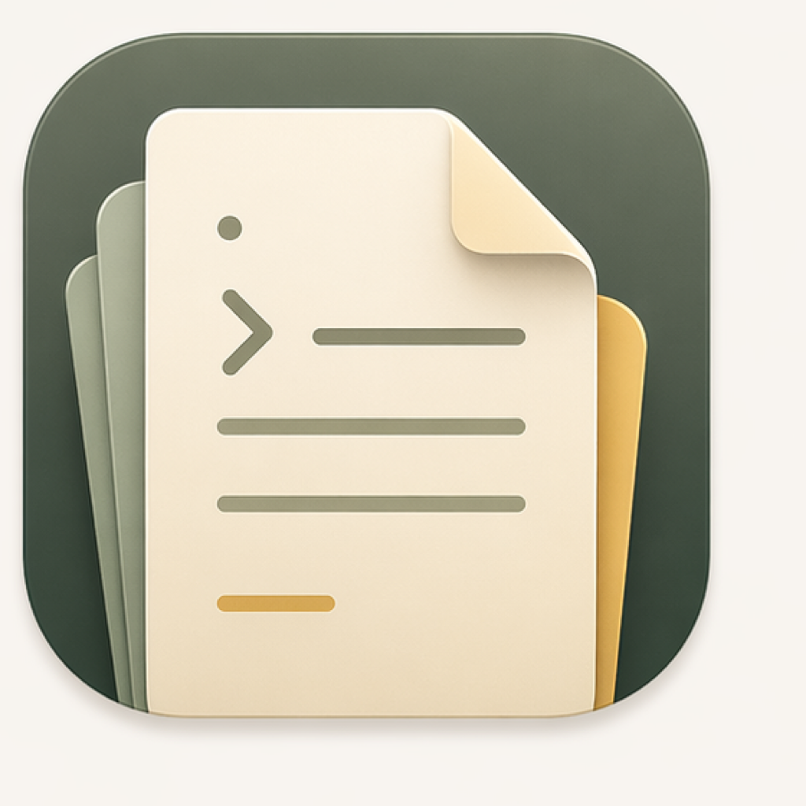

# Archive

Archive is a native macOS notes app for working directly on Markdown files in a local workspace. It keeps files canonical on disk, treats `.archive/` metadata as optional workspace state, and gives you both list and board views over the same note set.

## App Icon

Early icon direction for Archive:



This is an early version of the app icon and should be treated as a working draft rather than final brand artwork.

## Current Scope

- Browse a workspace of Markdown notes and folders
- Edit note bodies with a native macOS text editor bridge
- Read and write frontmatter-backed properties
- Switch between list and board presentations
- Search across note titles, body content, and properties
- Copy plain text or rendered HTML fragments for publishing workflows

## Stack

- SwiftUI for the app shell
- AppKit-backed text editing for the Markdown editor
- `swift-markdown` for Markdown handling
- `Yams` for frontmatter serialization
- `XcodeGen` for project generation from `project.yml`

## Requirements

- macOS 15 or later
- Xcode 16 or later
- Homebrew `xcodegen` if you want to regenerate the project file

## Development

Build:

```sh
xcodebuild build -project Archive.xcodeproj -scheme Archive -destination 'platform=macOS'
```

Test:

```sh
xcodebuild test -project Archive.xcodeproj -scheme Archive -destination 'platform=macOS'
```

Regenerate the Xcode project after changing `project.yml`:

```sh
xcodegen generate
```

## Repository Layout

- `Archive/`: app code
- `ArchiveTests/`: unit and integration-style tests
- `project.yml`: XcodeGen source of truth
- `Archive.xcodeproj/`: generated Xcode project checked into the repo
